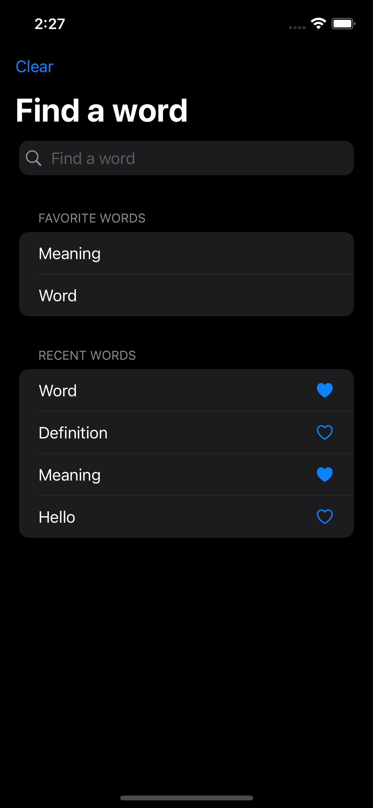
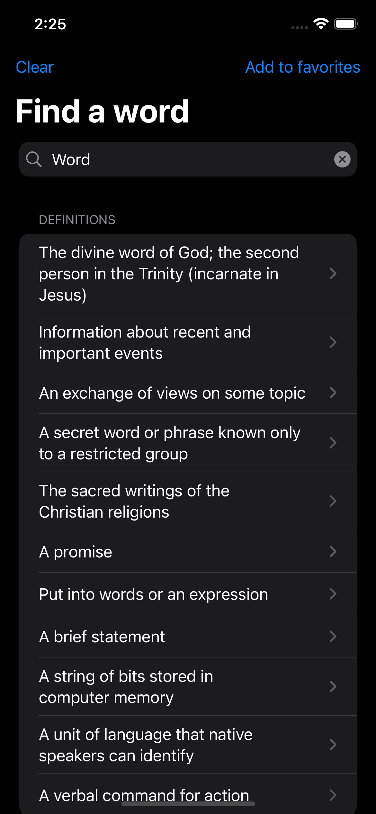
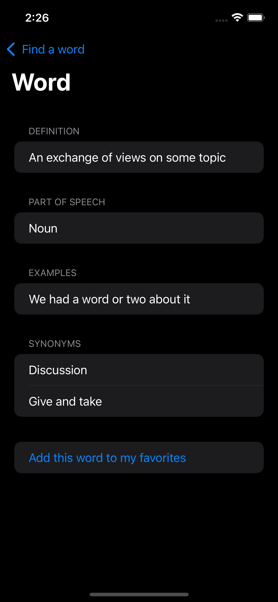
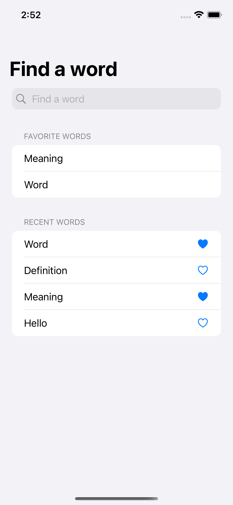
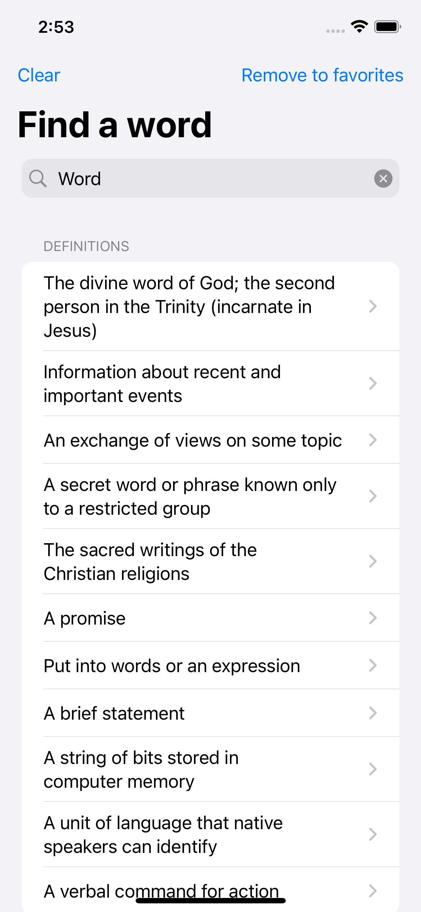
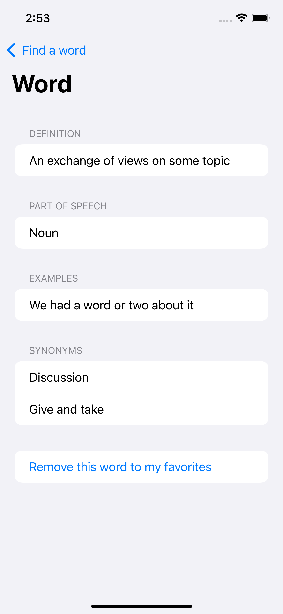

# Word
Find an English word and see all definitions and details - Personnal SwiftUI Project

Hey ! this is a personal project in order to improve my english skill.\
Instead of going on Google Traduction to translate a word, just go on this app, search it and learn with reading the different definitions of your word.

---
Here is the different features of the app:
- Search every english word you want in the english dictionnary.
- See the details of the definitions and it's examples, synonyms.
- Fav the words you want.
- Delete recent words and favorite by sliding the row
- Press on your recent and favorite words to access faster to the definitions
- Light and Dark mode handled
- Recent and Favorites words are store in UsersDefault
---

  
Dark Mode

  
  
  

  
Light Mode

  
  
  

